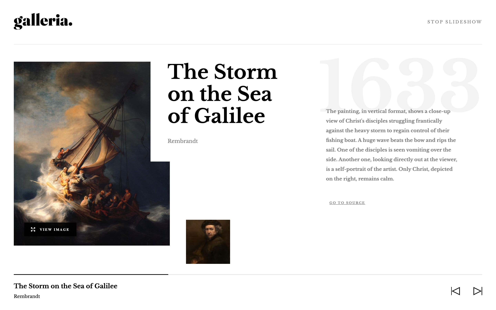

# Frontend Mentor - Galleria slideshow site solution

This is my solution to the [Galleria slideshow site challenge on Frontend Mentor](https://www.frontendmentor.io/challenges/galleria-slideshow-site-tEA4pwsa6).

## Table of contents

- [Overview](#overview)
  - [The challenge](#the-challenge)
  - [Screenshot](#screenshot)
  - [Links](#links)
- [My process](#my-process)
  - [Built with](#built-with)
  - [What I learned](#what-i-learned)
  - [Continued development](#continued-development)
  - [Useful resources](#useful-resources)
- [Author](#author)

## Overview

### The challenge

Users should be able to:

- View the optimal layout for the app depending on their device's screen size
- See hover states for all interactive elements on the page
- Navigate the slideshow and view each painting in a lightbox

### Screenshot

### Links

- Solution URL: [Add solution URL here](https://your-solution-url.com)
- Live Site URL: [https://galleria-slide-show.vercel.app/](https://galleria-slide-show.vercel.app/)
- GitHub URL: [https://github.com/brianlfarmerllc/Galleria_SlideShow](https://github.com/brianlfarmerllc/Galleria_SlideShow)

## My process

### Built with

- Semantic HTML5 markup
- Flexbox
- CSS Grid
- Mobile-first workflow
- [Next.js](https://nextjs.org/) - React framework

### What I learned

I wanted to do this project because it seemed like a perfect one to test on Next.js. I have been wanting to get started with Next after becoming more confident with react. I had a blast using it and it mad creating the individual gallery pages so much easier.

### Continued development

I did not take the time to optomize the image sizes so things load slowly but I plan on fixing this soon as well as checking out how to implement the next/image tag. I tried it out but the images had some strange behaviour that I could not figure out. I also want to learn how to implement page transitions with Next js so look for an updated solution soon.

### Useful resources

- [NextJs Basics Tutorial](https://nextjs.org/learn/basics/create-nextjs-app?utm_source=next-site&utm_medium=homepage-cta&utm_campaign=next-website) - I learned more from the documentation tutorial than any intro to js video I watched on youtube. This tutorial is basic but it teaches you how to use static props and how to get started creating something
- [Next Js Documentation](https://nextjs.org/docs/getting-started) - Documentation from Next is top notch.

## Author

- Website - [Brian Farmer](https://brianfarmerwebdev.netlify.app)
- GitHub URL: - [GitHub URL](https://github.com/brianlfarmerllc)
- Frontend Mentor - [@brianlfarmerllc](https://www.frontendmentor.io/profile/brianlfarmerllc)
